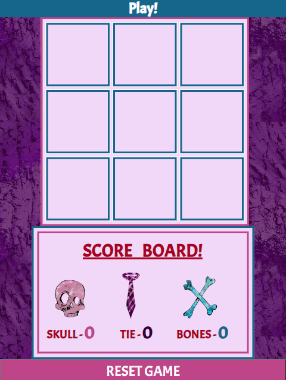
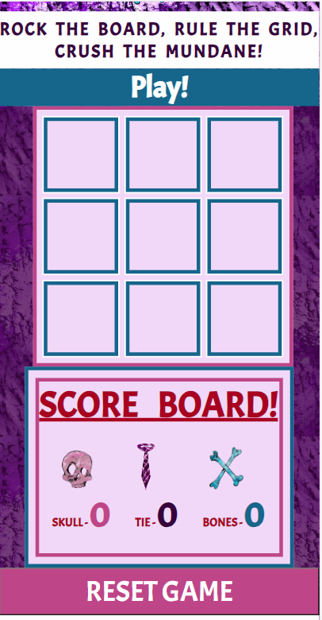
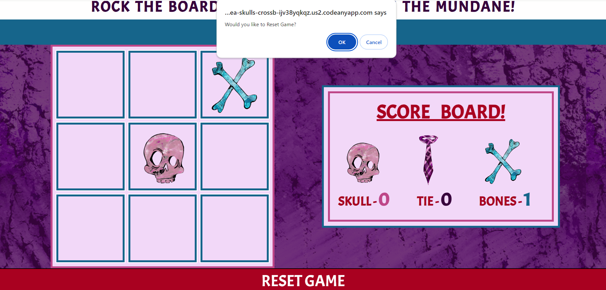
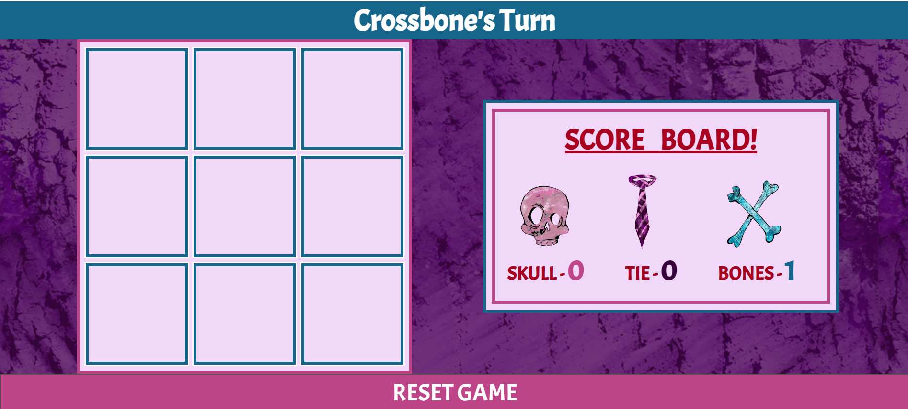
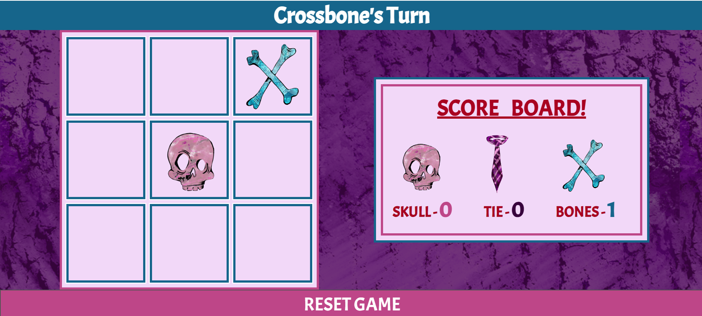

# Skulls & Crossbones

## Project Overview
Greetings and welcome to the README for 'Skulls & Crossbones' – a thrilling twist on the timeless classic, Noughts & Crosses. In this captivating web game, two players engage in a strategic battle, taking turns to strategically place their character pieces on a gridded table. The ultimate goal? Achieve a triumphant sequence of three in a row to emerge as the undisputed champion. Dive into the world of 'Skulls & Crossbones' for an exhilarating gaming experience that puts a fresh spin on a beloved classic.

## Features
### Key Existing features
#### Web Tab Icon:
  Displayed in the image below is the distinctive icon featuring the official game logo, showcasing the iconic skull and cross graphic alongside the site's name, 'Skulls & Crossbones.' This attention-grabbing tab icon ensures clarity and an official aesthetic. In a scenario where users have numerous tabs open, locating their newfound favorite game becomes a breeze with this easily recognizable and professional-looking icon.

#### Game Logo and Tagline:
 Upon entering the web documents, users are immediately greeted by the game's logo positioned at the top of the screen. This distinctive logo prominently showcases the game's title, 'Skulls & Crossbones,' with the two graphic elements representing the Skull and Crossbow player pieces (X and O) positioned in the middle of the name. This arrangement provides users with a visual hint of the site's style and the primary objective of the game.

Directly beneath the game logo, the header or tagline of the game reads: "Rock the board, rule the grid, crush the mundane!" This catchy and spirited phrase perfectly encapsulates the game's new style, adding a punky edge to the overall experience. Get ready to embrace a gaming journey that blends style and excitement, setting 'Skulls & Crossbones' apart from the ordinary.

#### The Game Area:
  In the main area of the web page is where the game playing section and inside that has three major features...

##### Status Text:
  The initial component is the status text, providing users with clear instructions regarding the current turn and announcing the victor of the game.

##### The Grid/Game Table:
 Central to the entire concept is the game interface itself. It features a conventional Noughts and Crosses grid table, adorned with color styles harmonizing with the overall webpage design while maintaining clarity in each boxed section. When a player clicks on a designated box, a graphical representation of either a skull or crossbone, contingent on the active turn, will be showcased. Once a winner is determined, users will no longer have the option to select additional boxes, and the pertinent information will seamlessly transition to the scoreboards section.

##### Scoreboard:
  Scoreboard – This area is to keeps score on how many games each player has won or how many tied games there have been. Colour styles matched with the grid/game table.
  Each player is labelled with both their graphic and text, there is also a graphic for the tied section.
  Text colour is all in Red but the numeral score colour is matched to the colour of the graphic for either skull, tie or croossbone.

#### Reset Button:
  Situated beneath the gaming area is the Reset Game button. Its primary function is to wipe the board clean, facilitating the initiation of a fresh game.

##### Reset button - Confirmation:
  Upon clicking the button, not only will the colors on the button undergo a change, but a pop-up will also appear, prompting the user to confirm their intention to initiate a new game. If the user proceeds with confirmation, the board will be reset, clearing all graphics. In the event of cancellation, the game will persist in its previous state.

This additional step is designed to enhance user experience, serving as a safeguard against accidental clicks and ensuring that users do not inadvertently lose their game progress.

#### Footer:
  Concluding the web page is a straightforward footer element, seamlessly harmonizing with the overall styles of the web documents. It encompasses copyright information and artistic credits, maintaining a balance of simplicity and precision.
  

## UX/UI SECTION
### Future Features
 Following three distinct focus groups involving trial runs with diverse user types and their invaluable feedback on the final game, potential enhancements for the future include:

##### Player vs. Computer Option
* Currently, the game supports multiplayer on a shared screen. In future updates, there is a plan to introduce the option for players to face off against the computer, expanding the gaming experience to player vs. computer and player vs. player modes.
  
##### Keyboard Control:
* Although initially considered with lower priority due to time constraints, future iterations may incorporate keyboard controls for desktop users. This enhancement aims to allow users to make moves using keyboard commands, such as Q, W, E, A, S, D, Z, X, C, providing an alternative and potentially more accessible method for playing the game.

##### Styled Confirmation Pop-Up:
* Future plans for the confirmation pop-up involve refining its appearance to better align with the overall aesthetic of the webpage. This entails incorporating stylistic elements that enhance the visual appeal, moving away from a plain and generic appearance.

##### Winner Display:
* Upon winning a round, future updates aim to deliver a more impactful and celebratory experience for the player. Potential ideas include:
* Traditional Naughts and Crosses procedures, such as lines going through the winner.
* A visually engaging pop-up display at the center of the screen with graphic elements.
This enhancement is designed to elevate the user experience, making the act of winning more memorable and enjoyable.

### User Stories
#### As a Game Player
* As a player of the game, I desire a visually intuitive interface that clearly indicates where I can make my moves.
* As a player of the game, I want the ability to reset the game.
* As a player of the game, I desire the ability to view and track the score.
* As a player of the game, I want to be presented with information on the winner of each round.

### Wireframes
Presented below are the initial design concepts for the game, tailored for both desktop and mobile devices.

The ultimate web page adheres closely to several elements from the original design, including the background, logos, graphics, and color themes. However, the current aesthetic has undergone significant refinement, elevating it beyond the initial concept. Crucial elements have been expanded upon, and a more extensive use of colors has been integrated to enhance visual appeal and avoid a monotonous appearance.

#### Desktop view:

#### mobile view

## Testing
### Manual Testing
Manual testing for this game and its features encompassed multiple rounds, ensuring the following:

* The status text accurately displays information about whose turn is next.
* The status text correctly reflects the winner of the round when a player achieves a winning sequence.
* The document consistently recognizes a winner or tied game sequence.
* Each box in the grid loads the appropriate graphic for the respective player (Skull or Crossbone).
* A box becomes unselectable if a player has previously chosen it.
* The game concludes, preventing further box selections, once a winner has been determined.
* After each round, the scoreboard accurately reflects the numerical points awarded for the winner or tied game.
  
Additionally, the testing covered the Reset button functionality, confirming that:

* The Reset button triggers a confirmation pop-up.
  

* If confirmed, the grid/game board clears of all graphics.

* If canceled, the game continues from where it was left off.

### Browser Compatibility:
Extensive testing of this game and its features was conducted on both Google Chrome and Microsoft Edge Explorer.

### Device Testing:
This web document has been tested on the following device screens using google chromes dev tools.

#### Desktop

* All standard laptop and desktop screen.

#### Mobile Screens

* Iphone 14 pro max
* Iphone 12 pro
* Iphone SE
* Samsung Galaxy 3
* Nokia lumai 520
* Pixel 4
* Blackberry Z30
* Galaxy s5
* Facebook on Android

#### Ipad Screens

* Ipad pro
* Ipad
* Ipad Air
* Ipad mini
* Galaxy Tab S4
* Kindle HDX

### Lighthouse
#### Desktop

#### Mobile

## Validator Testing
The entire code underwent thorough validation testing.
### HTML
https://validator.w3.org/ - No Errors or Warnings to Show.
### CSS
https://jigsaw.w3.org/css-validator/ - No Error Found.
### Javascript
https://jshint.com/ - No Error or Warnings.

## Deployment
### Skulls & Crossbones has been deployed to GitHub Pages
GitHub Deployment Steps -
* Open the GitHub repository.
* Navigate to "Settings" located at the top right of the screen.
* Select the "Pages" tab from the left sidebar under 'Code and automation' (it's the eighth option down).
* In the 'Build and deployment' section, locate the 'Branch' subsection.
* Choose the source branch (either "main" or "master") from the drop-down menu next to "none"/"select branch."
* Click on "Save" to apply the changes.
* Be patient as the system processes the request. This may take some time.
* Once the page updates, you will find a link for the deployed page within the GitHub Pages section.
* Confirm the deployment by checking for the message: "Your site is live at <https://amberrosea.github.io/SkullsandCrossbones/>."

### Skulls & Crossbones has been deployed with GIT on Codeanywhere
Codeanywhere deployment Steps -

* Wait for the workspace to fully load.
* If the terminal is not visible at the bottom of the screen, select 'Terminal' at the top left of the page.
* Click on the first option, 'New Terminal.'
* In the Terminal input field, enter 'python3 -m http.server.'
* A pop-up window should appear at the bottom right of the screen, providing the option to 'preview' or 'open in the browser.'
* Choose 'open in the browser,' and a new tab will display the launched website.
* If the pop-up window doesn't appear, click on the port in the bottom right corner.
* This will open a window where you can click 'open in the browser.'
* For version control:
* Execute 'git add .' followed by 'enter.'
* Use 'git commit -m "notes on changes" enter' to record your changes. These commands are particularly useful when adding content or making modifications.
* Finally, 'git push enter' to save your changes onto the server.

## Technologies
* Adobe (Capture, Fresco and Photoshop) - Platforms used to create graphics and Wireframes
* Github
* Codeanywhere
* HtML, CSS, JavaScript
* <https://validator.w3.org/> https://jigsaw.w3.org/css-validator/ https://jshint.com/ - Sites used to validate code.
* https://chat.openai.com/ - Explaining elements of code when it was not clicking and assisting me in wording text in readme
* google - search engine.

## Credits 
### Contents
* Code institute/ Love Maths Walk through project -- <https://github.com/Code-Institute-Solutions/love-maths-2.0-sourcecode/blob/master/04-multiplication-and-subtraction-questions/02-the-subtraction-game/assets/js/script.js> -- Initial starting point and guide.
* Code institute/ Love Maths README.md -- <https://github.com/Code-Institute-Solutions/readme-love-maths/blob/master/README.md> -- Guide for content and layout of README file.
* Code institute/ Love Maths css -- <https://raw.githubusercontent.com/Code-Institute-Solutions/JS-Essentials-Project/master/03-Getting%20Stylish/style_starter.css> -- Referance/ guide for css styles to use.
* Code institute/ Love Maths html -- https://github.com/Code-Institute-Solutions/love-maths-2.0-sourcecode/blob/master/02-adding-some-javascript/01-adding-structure/index.html -- Referance/ guide.
* mdn web docs/ creating and triggering events -- <https://developer.mozilla.org/en-US/docs/Web/Events/Creating_and_triggering_events> -- Gathering more information on event listeners.
* mdn web docs/ Document: DOMContentLoaded event -- https://developer.mozilla.org/en-US/docs/Web/API/Document/DOMContentLoaded_event -- Make sure page is fully loaded before game can be played.
* W3Schools tryit Editor/ The grid-template-columns property -- <https://www.w3schools.com/cssref/tryit.php?filename=trycss_grid-template-columns> -- For further information on creating grid columns.
* W3Schools/ CSS grid-template-columns -- <https://www.w3schools.com/cssref/pr_grid-template-columns.php> -- For further information on creating grid columns.
* W3Schools tryiteditor/ The window object -- <https://www.w3schools.com/jsref/tryit.asp?filename=tryjsref_confirm3> -- Information for confimation popup for reset
* W3Schools/ Window Confirm -- https://www.w3schools.com/jsref/met_win_confirm.asp -- Confirmation on confirm pop up for reset button.
* Study tonight/ How to Make a Tic Tac Toe Game in JavaScript [2023] -- https://www.studytonight.com/post/building-a-tic-tac-toe-game-in-javascript#google_vignette -- Inital reseach on game and ideas.
* https://www.youtube.com/watch?v=AnmwHjpEhtA -- TicTacToe tutorial, for annital ideas and example of the fundementals needed for the game.
* https://www.youtube.com/watch?v=kRQEkTHIEyU -- Tic tac toe tutorial, for ideas and example for js code, implementing graphics elements.
* https://codepen.io/captain-mad/pen/ggYozp -- ideas for js code for the tic tac toe game (vs computer).
* <https://playtictactoe.org/#google_vignette> - Insperation/ Research of game
* Rohit Sharma/ Mentor -- For guidence, feedback and suggestions.

### Media

* Font - google fonts <https://fonts.google.com/?preview.text=SKULLS%20%26%20CROSSBONES&query=Scrip>
* Favicon - Favicon.io <https://favicon.io/favicon-converter/#google_vignette>
* Icons - Font Awesome https://fontawesome.com/search
* All Graphics (background image, logo, player graphics ect.) - Amber Andrews (me).
